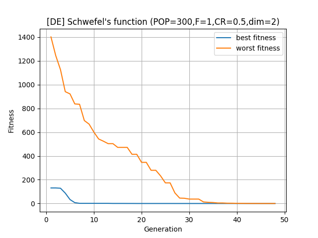

# Differential Evolution in Python

A simple implementation of differential evolution algorithm in Python according to the wikipedia page[1].
Objective function is currently set as Schwefel's function.

### Preview
An example of visualizing the fitness of minimizing 2D Schwefel's function  through generation.  

### Reference
[1]. [Differential evolution - Wikipedia](https://en.wikipedia.org/wiki/Differential_evolution)
